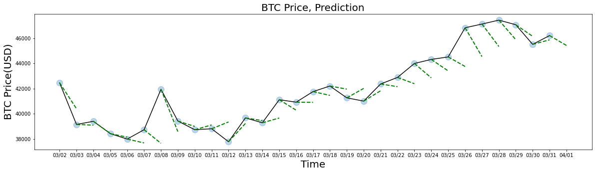
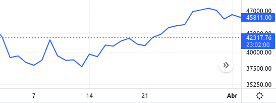

<div id="top"></div>

[![LinkedIn][linkedin-shield]][linkedin-url]
[![Contributors][contributors-shield]][contributors-url]
[![Forks][forks-shield]][forks-url]
[![Stargazers][stars-shield]][stars-url]
[![Issues][issues-shield]][issues-url]
[![GNU v3 License][license-shield]][license-url]


<!-- PROJECT LOGO -->
<br />
<div align="center">
  <a href="https://github.com/estebanvz/crypto_prediction/">
    
  </a>

  <h3 align="center"> Crypto Price Prediction Pipeline - Python Package
</h3>

  <p align="center">
    Python Package to create a pipeline for price prediction using a keras neural network model.
    <br />
    <!-- <a href="https://github.com/estebanvz/crypto_prediction"><strong>Explore the docs »</strong></a>
    <br /> -->
    <br />
    <a href="https://github.com/estebanvz/crypto_prediction/">View Test</a>
    ·
    <a href="https://github.com/estebanvz/crypto_prediction/issues">Report Bug</a>
    ·
    <a href="https://github.com/estebanvz/crypto_prediction/issues">Request Feature</a>
  </p>
</div>


<!-- TABLE OF CONTENTS
<details>
  <summary>Table of Contents</summary>
  <ol>
    <li>
      <a href="#about-the-project">About The Project</a>
      <ul>
        <li><a href="#built-with">Built With</a></li>
      </ul>
    </li>
    <li>
      <a href="#getting-started">Getting Started</a>
      <ul>
        <li><a href="#prerequisites">Prerequisites</a></li>
        <li><a href="#installation">Installation</a></li>
      </ul>
    </li>
    <li><a href="#usage">Usage</a></li>
    <li><a href="#roadmap">Roadmap</a></li>
    <li><a href="#contributing">Contributing</a></li>
    <li><a href="#license">License</a></li>
    <li><a href="#contact">Contact</a></li>
    <li><a href="#acknowledgments">Acknowledgments</a></li>
  </ol>
</details> -->


<!-- ABOUT THE PROJECT -->
## About The Package

This is a small package to produce pipelines to predict the btc price using keras neural networks.
<p align="right">(<a href="#top">back to top</a>)</p>


### Built With

This project was builded with the next technologies.

* [Python](https://python.org/)
* [Keras](https://keras.io/)
* [Tensorflow](https://www.tensorflow.org/)
* [Scikit-learn](https://scikit-learn.org/)
* [Jupyter](https://jupyter.org/)
<p align="right">(<a href="#top">back to top</a>)</p>


<!-- GETTING STARTED -->
## Getting Started


<!-- ### Prerequisites

You need the next components to run this project.
* Docker. To install it follow these steps [Click](https://docs.docker.com/get-docker/). 
  On Ubuntu, you can run:
```sh
sudo apt-get install docker-ce docker-ce-cli containerd.io
```
* Visual Studio Code. To install it follow these steps [Click](https://code.visualstudio.com/download). On Ubuntu, you can run:
```sh
sudo snap install code --classic
```
* Install the visual studio code extension "Remote - Containers" -->
### Building

Follow the next steps:

1. Setup the project:
   ```python
   python setup.py sdist
   ```
2. Build the package:
   ```python
   python setup.py build
   ```
3. Install the package
   ```python
   python setup.py install
   ```
4. Install the package using pip.
    ```bash
    pip install crypto_prediction
    ```
<p align="right">(<a href="#top">back to top</a>)</p>

### Intalling

Just need to use pip with git command:
```python
pip install git+https://github.com/estebanvz/crypto_prediction.git
```

### Usage

Get the keys from API Binance:

[GET BINANCE API KEYS](https://www.binance.com/en/support/faq/360002502072)

You can use the package using the **api_key** and **api_secret** from binance API.
Also you could download the package **crypo_price** to download data from Binance API.
[Crypto Price Package](https://github.com/estebanvz/crypto_price)
```python
import os
import keras
from crypto_prediction import CryptoPredictor

c_predictor = CryptoPredictor(time_interval="1d")
c_predictor.download_crypto_dataset()
c_predictor.calculate_metrics()
c_predictor.load_dataset(path="datasets/1d/BTCUSDT.csv")
c_predictor.lag_variables(n_lags=60)
c_predictor.calculate_labels(n_times_future=5)
## To train a new model you can use split and normalize dataset function
# x_train_n, x_test_n, y_train, y_test = c_predictor.normalize_split_dataset(split_data=100)
regressor = keras.models.load_model("btcusdt1d0.039mae.h5")
c_predictor.set_keras_model(keras_model=regressor)
c_predictor.draw_prediction(x_test_n=x_test_n,n_future_steps=2)

```
### Predicción



The black line is the real price and the green dotted lines are the prediction made by the algorithm.

### Real price


The real price on tradingview show us that the prediction of the algorithm was accurate.
## Results

We can observe how the algorithm developed to test this pipeline produce a prediction of one day in the future that predict a range.
The real price movement the next day was too close to the prediction of the algorithm.

It is needed more research in this algorithm to produce better results.
The algorithm evaluated in this model produces a MAE of 0.021 in 100 days test dataset.

<!-- USAGE EXAMPLES
## Usage

Use this space to show useful examples of how a project can be used. Additional screenshots, code examples and demos work well in this space. You may also link to more resources.

_For more examples, please refer to the [Documentation](https://example.com)_

<p align="right">(<a href="#top">back to top</a>)</p>


<!-- ROADMAP -->
<!-- ## Roadmap

- [x] Add Changelog
- [x] Add back to top links
- [ ] Add Additional Templates w/ Examples
- [ ] Add "components" document to easily copy & paste sections of the readme
- [ ] Multi-language Support
    - [ ] Chinese
    - [ ] Spanish

See the [open issues](https://github.com/estebanvz/crypto_prediction/issues) for a full list of proposed features (and known issues).

<p align="right">(<a href="#top">back to top</a>)</p> -->

<!-- LICENSE -->
## License

Distributed under the MIT License. See `LICENSE` for more information.

<p align="right">(<a href="#top">back to top</a>)</p>


<!-- CONTACT -->
## Contact

Esteban Vilca - [@ds_estebanvz](https://twitter.com/ds_estebanvz) - [esteban.wilfredo.g@gmail.com](mailto:esteban.wilfredo.g@gmail.com)

Project Link: [https://github.com/estebanvz/crypto_prediction](https://github.com/estebanvz/crypto_prediction)

<p align="right">(<a href="#top">back to top</a>)</p>


<!-- MARKDOWN LINKS & IMAGES -->
<!-- https://www.markdownguide.org/basic-syntax/#reference-style-links -->
[contributors-shield]: https://img.shields.io/github/contributors/estebanvz/crypto_prediction.svg
[contributors-url]: https://github.com/estebanvz/crypto_prediction/graphs/contributors
[forks-shield]: https://img.shields.io/github/forks/estebanvz/crypto_prediction.svg
[forks-url]: https://github.com/estebanvz/crypto_prediction/network/members
[stars-shield]: https://img.shields.io/github/stars/estebanvz/crypto_prediction.svg
[stars-url]: https://github.com/estebanvz/crypto_prediction/stargazers
[issues-shield]: https://img.shields.io/github/issues/estebanvz/crypto_prediction.svg
[issues-url]: https://github.com/estebanvz/crypto_prediction/issues
[license-shield]: https://img.shields.io/github/license/estebanvz/crypto_prediction.svg
[license-url]: https://github.com/estebanvz/crypto_prediction/blob/main/LICENSE
[linkedin-shield]: https://img.shields.io/badge/-LinkedIn-black.svg?=linkedin&colorB=888
[linkedin-url]: https://linkedin.com/in/estebanvz
[product-screenshot]: images/screenshot.png